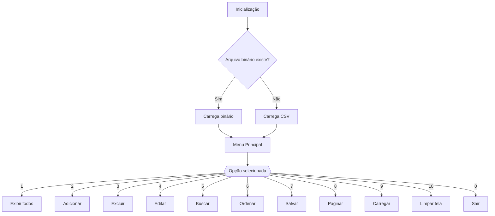

# Pokedex Pokemon - Documentação Completa
## Visão Geral
Este projeto implementa uma Pokédex em C++, com suporte para:
- Visualização, adição, edição, exclusão e busca de Pokémons.
- Carregamento e armazenamento de dados a partir de arquivos CSV ou binários.
- Ordenação de dados em diferentes campos.

## Estrutura dos Dados
A estrutura `pokemon` armazena as seguintes informações:

```cpp
struct pokemon {
  int id;             // Identificador único do Pokémon
  char nome[16];      // Nome do Pokémon (até 15 caracteres)
  char tipo[32];      // Tipo(s) do Pokémon (até dois tipos separados por espaço)
  int total;          // Soma total dos atributos do Pokémon
  int hp;             // Pontos de vida (HP)
  int ataque;         // Valor do ataque
  int defesa;         // Valor da defesa
  int spataque;       // Valor do ataque especial
  int spdefesa;       // Valor da defesa especial
  int speed;          // Valor da velocidade
  int geracao;        // Geração do Pokémon
  bool lendario;      // Indicador se o Pokémon é lendário
};
```


## Funções Implementadas

### Manipulação da Pokédex

#### 1. 
```cpp
bool inicializar_pokedex(pokemon *&pokedex, int &id, int &tamPokedex, int &tamMax, int margem, string &cabecalho, const string &nomeArquivo)
```

Carrega os dados dos Pokémons a partir de um arquivo CSV.

##### **Parâmetros:**
```cpp
pokemon *&pokedex;    // Ponteiro para armazenar os Pokémons
int &id;              // Referência para o último ID registrado
int &tamPokedex;      // Referência ao tamanho atual da Pokédex
int &tamMax;          // Referência ao tamanho máximo da Pokédex
int margem;           // Margem para expansão dinâmica
string &cabecalho;    // String para armazenar o cabeçalho do arquivo
const string &nomeArquivo;  // Nome do arquivo CSV a ser lido
```

##### **Retorno:**
```cpp
true;  // Se o arquivo foi carregado com sucesso
false; // Se houve falha ao abrir o arquivo
```

#### 2. 
```cpp 
bool inicializar_pokedex_binario(pokemon *&pokedex, int &id, int &tamPokedex, int &tamMax, int margem, const string &nomeArquivoBinario)
```

Carrega os dados dos Pokémons a partir de um arquivo binário.

##### **Parâmetros:**
```cpp
pokemon *&pokedex;               // Ponteiro para armazenar os Pokémons
int &id;                         // Referência para o último ID registrado
int &tamPokedex;                 // Referência ao tamanho atual da Pokédex
int &tamMax;                     // Referência ao tamanho máximo da Pokédex
int margem;                      // Margem para expansão dinâmica
const string &nomeArquivoBinario; // Nome do arquivo binário a ser lido
```

##### **Retorno:**
```cpp
true;  // Se o arquivo binário foi carregado com sucesso
false; // Se houve falha ao abrir o arquivo
```

#### 3. 
```cpp
void adicionar(pokemon *&pokedex, int &id, int &tamPokedex, int &tamMax, int margem)
```

Adiciona um novo Pokémon ao array.

##### **Parâmetros:**
```cpp
pokemon *&pokedex; // Ponteiro para a Pokédex
int &id;           // Referência para o ID a ser atribuído ao novo Pokémon
int &tamPokedex;   // Referência ao tamanho atual da Pokédex
int &tamMax;       // Referência ao tamanho máximo da Pokédex
int margem;        // Margem para expansão dinâmica
```

##### **Descrição:**
- Expande dinamicamente o array se necessário.
- Solicita ao usuário as informações do novo Pokémon.
- Realiza validações para garantir integridade dos dados.

#### 4. 
```cpp
void excluir(pokemon *&pokedex, int &tamPokedex, int &tamMax, int margem, int idMax)
```

Remove um Pokémon especificado pelo ID.

##### **Parâmetros:**
```cpp
pokemon *&pokedex; // Ponteiro para a Pokédex
int &tamPokedex;   // Referência ao tamanho atual da Pokédex
int &tamMax;       // Referência ao tamanho máximo da Pokédex
int margem;        // Margem para ajuste do tamanho do array
int idMax;         // Valor máximo permitido para ID
```

##### **Descrição:**
- Busca o Pokémon pelo ID fornecido.
- Remove o elemento e reorganiza o array.
- Redimensiona o array se o tamanho cair abaixo da margem permitida.

#### 5. 
```cpp 
void salva_arquivo(pokemon *pokedex, int tamPokedex, string cabecalho)
```

Salva os dados em formato CSV.

##### **Parâmetros:**
```cpp
pokemon *pokedex; // Ponteiro para a Pokédex
int tamPokedex;   // Tamanho atual da Pokédex
string cabecalho; // Cabeçalho a ser salvo no arquivo
```

##### **Descrição:**
- Solicita o nome do arquivo ao usuário.
- Salva os dados dos Pokémons no formato CSV.

#### 6. 
```cpp 
void salva_arquivo_binario(pokemon *pokedex, int tamPokedex)
```

Salva os dados em formato binário.

##### **Parâmetros:**
```cpp
pokemon *pokedex; // Ponteiro para a Pokédex
int tamPokedex;   // Tamanho atual da Pokédex
```

##### **Descrição:**
- Solicita o nome do arquivo ao usuário.
- Salva os dados dos Pokémons no formato binário.

#### 7. 
```cpp 
void exibir_menu()
```

Exibe as opções do menu para o usuário.

#### 8. 
```cpp 
pokemon *busca_binaria_nome(pokemon *pokedex, int inicio, int fim, const char *nome)
```

Realiza busca binária por nome.

##### **Parâmetros:**
```cpp
pokemon *pokedex;     // Ponteiro para a Pokédex
int inicio, fim;      // Intervalo para a busca
const char *nome;     // Nome do Pokémon a buscar
```

##### **Retorno:**
```cpp
pokemon *; // Ponteiro para o Pokémon encontrado ou nullptr se não encontrado
```

#### 9. 
```cpp 
pokemon *busca_binaria_id(pokemon *pokedex, int inicio, int fim, int id)
```

Realiza busca binária por ID.

##### **Parâmetros:**
```cpp
pokemon *pokedex;     // Ponteiro para a Pokédex
int inicio, fim;      // Intervalo para a busca
int id;               // ID do Pokémon a buscar
```

##### **Retorno:**
```cpp
pokemon *; // Ponteiro para o Pokémon encontrado ou nullptr se não encontrado
```

#### 10. 
```cpp 
void quicksort(pokemon *pokedex, int inicio, int fim, int campo, bool crescente)
```

Ordena os Pokémons com base em um campo especificado.

##### **Parâmetros:**
```cpp
pokemon *pokedex; // Ponteiro para a Pokédex
int inicio, fim;  // Intervalo para ordenação
int campo;       // Campo de ordenação (1 para ID, 2 para nome, etc.)
bool crescente;  // Ordenação crescente ou decrescente
```

#### 11. 
```cpp 
bool compara(pokemon x, pokemon y, int campo, bool crescente)
```

Compara dois Pokémons com base em um campo.

##### **Parâmetros:**
```cpp
pokemon x, y;    // Pokémons a serem comparados
int campo;       // Campo para comparação
bool crescente;  // Ordenação crescente ou decrescente
```

##### **Retorno:**
```cpp
true;  // Se a condição de ordenação é satisfeita
false; // Caso contrário
```
---

### Utilidades

#### 1. 
```cpp
void limpar_buffer()
```

Limpa o buffer de entrada.

#### 3. 
```cpp
int validar_inteiro(const char *mensagem, int min, int max)
```
Valida a entrada de um número inteiro dentro de um intervalo especificado.

##### **Parâmetros:**
```cpp
const char *mensagem; // Mensagem para solicitação de entrada
int min, max;         // Limites inferior e superior
```

##### **Retorno:**
```cpp
int; // Valor inteiro validado
```


### 3.
```cpp
void validar_tipos(char *destino)
```
Valida os tipos inseridos pelo usuário, que podem ser até dois tipos separados por espaço. Verifica se os tipos pertencem a uma lista de tipos válidos de Pokémon.

##### **Parâmetros:**
```cpp
char *destino; // Ponteiro para armazenar os tipos validados
```

### 4.
```cpp
void validar_nome(pokemon *pokedex, int tamPokedex, char *nome, int tamanho)
```
Valida o nome de um Pokémon inserido pelo usuário. O nome não pode ultrapassar 15 caracteres e não pode ser duplicado.

##### **Parâmetros:**
```cpp
pokemon *pokedex; // Ponteiro para a Pokédex
int tamPokedex;   // Tamanho atual da Pokédex
char *nome;       // Ponteiro para armazenar o nome validado
int tamanho;      // Tamanho máximo permitido para o nome
```

#### 5. 
```cpp
string pokemon_to_string(pokemon &pokemon)
```

Converte os dados de um Pokémon em uma string formatada.

##### **Parâmetros:**
```cpp
pokemon &pokemon; // Referência ao Pokémon a ser convertido
```

##### **Retorno:**
```cpp
string; // Representação formatada dos dados do Pokémon
```
## Apresentação - Menu de Opções
```plaintext
================= MENU POKEDEX =================
1. Exibir Todos Pokemons
2. Adicionar Pokemon
3. Excluir Pokemon
4. Editar Pokemon
5. Buscar Pokemon
6. Ordenar Pokemons
7. Salvar em arquivo
8. Exibir de X a Y
9. Carregar arquivo
10. Limpar Tela
0. Sair
================================================
```


## Fluxo de Trabalho


## Compilação e Execução
```bash
g++ -o pokedex pokedex.cpp
./pokedex
```
